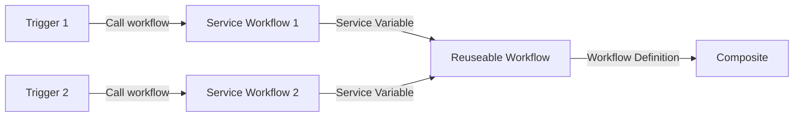

# Aion - God of the cyclic ages, and the cycle of the year and the zodiac
## Centralize Github workflow
Learning and implementing github action workflow with centralize management

### Goals
Proof of concept for centralize mindset for Github Action workflow

#### Schema

#### Detail
- Trigger 1: Calling workflow from service repository activity
- Trigger 2: Calling workflow from service repository activity
- Service Workflow 1: Workflow with variable that will be pass to reuseable workflow containing go lang service detail
- Service Workflow 2: Workflow with variable that will be pass to reuseable workflow containing nodejs service detail
- Reuseable workflow: Workflow that defines all jobs and step that needs to be done
- Composite: The tiny step by step that will be done by runner

### Project Detail
- Monorepository application from repository https://github.com/faderosyad/simple-app-test

